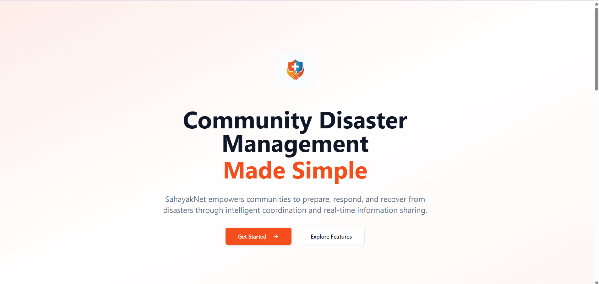
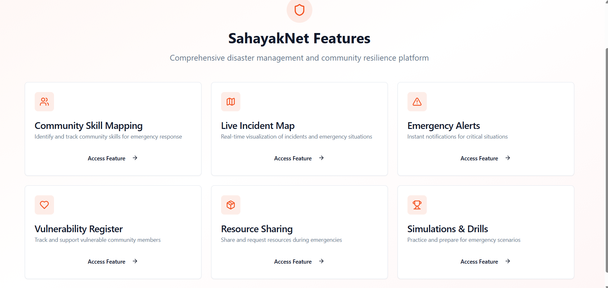
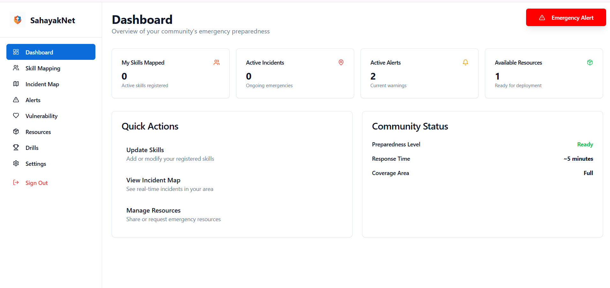
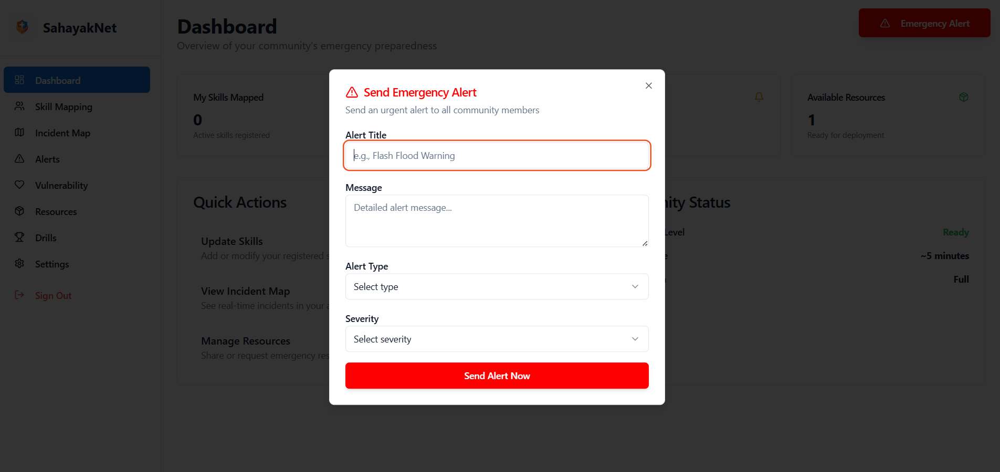
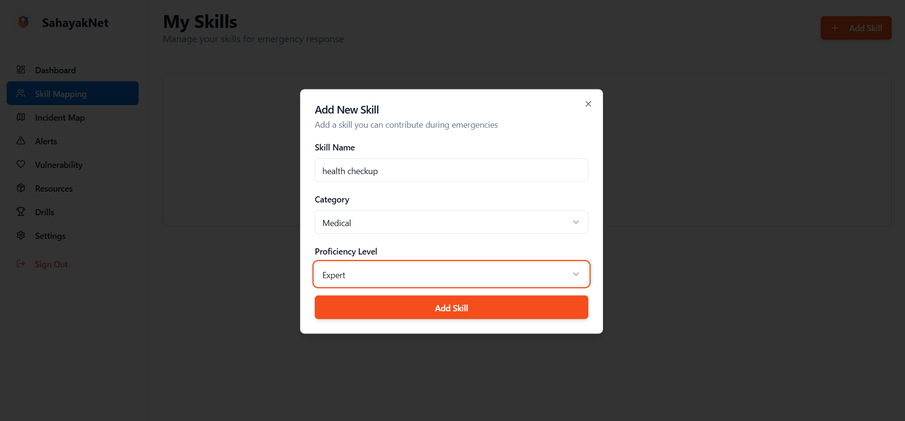
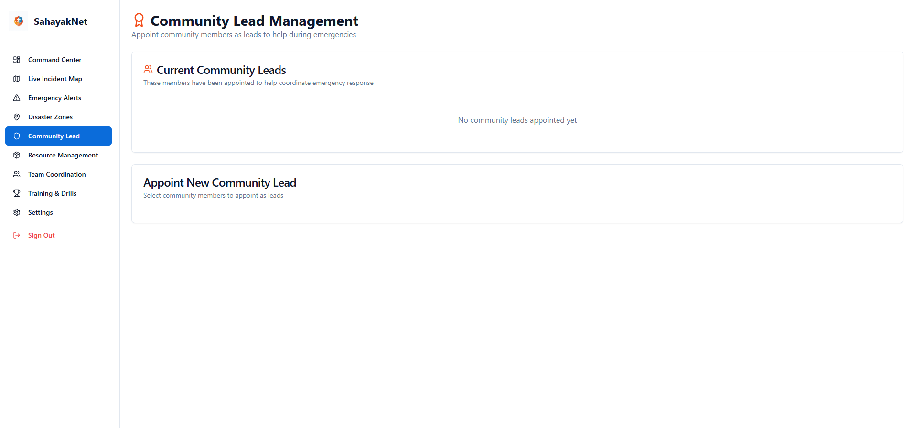
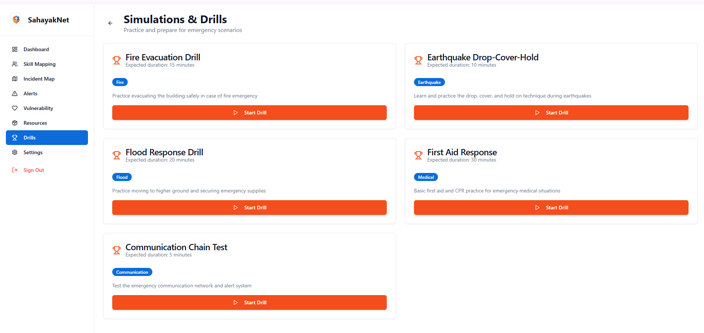
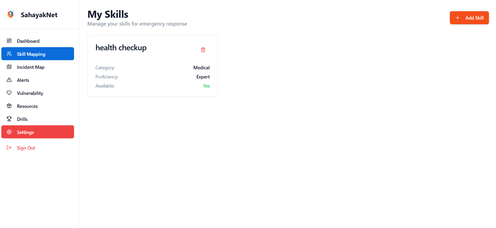
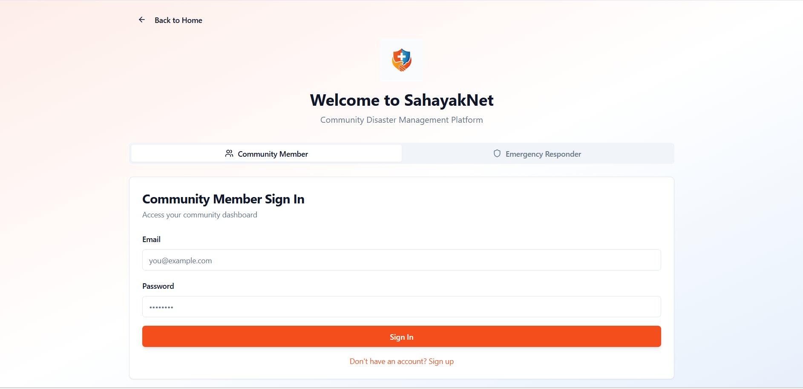
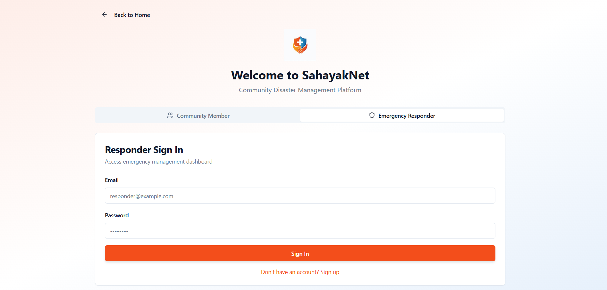

# SahayakNet - Disaster Management & Emergency Response Platform

## Overview

SahayakNet is a comprehensive disaster management and emergency response platform designed to improve coordination between citizens, volunteers, community leaders, and authorities during natural or man-made disasters.

The platform enables real-time incident reporting, emergency alerts, resource sharing, vulnerability tracking, and disaster response coordination. It is designed to support communities from local neighborhoods to larger regions and can operate with offline-first considerations to ensure accessibility during network disruptions.

---

## Problem Statement

During disasters, communities often face challenges such as:

* Delayed communication
* Lack of resource visibility
* Inefficient volunteer coordination
* Difficulty identifying vulnerable populations
* Limited situational awareness

SahayakNet addresses these challenges through a centralized digital platform for disaster preparedness and response.

---

## Key Features

### Emergency Alerts

* Send and receive critical disaster notifications
* Real-time alert dissemination

### Live Incident Mapping

* Visualize disaster incidents on interactive maps
* Track affected areas and response activities

### Resource Sharing

* Manage and distribute essential resources
* Coordinate food, medical supplies, shelters, and relief materials

### Skill Mapping

* Identify volunteers based on skills and expertise
* Improve emergency response efficiency

### Vulnerability Register

* Maintain records of vulnerable individuals and communities
* Prioritize support during emergencies

### Community Leadership Management

* Coordinate local leaders and emergency responders
* Facilitate structured communication

### Disaster Zone Monitoring

* Monitor disaster-prone and affected regions
* Improve situational awareness

### Secure Authentication

* User registration and login using Supabase Authentication
* Role-based access control

---

## Technology Stack

### Frontend

* React
* TypeScript
* Vite
* Tailwind CSS

### Backend & Database

* Supabase
* PostgreSQL

### Authentication

* Supabase Authentication

### Development Tools

* Git
* GitHub

---

## Project Structure

```
src/
├── components/
├── pages/
├── hooks/
├── lib/
├── integrations/
└── types/

supabase/
├── functions/
└── migrations/
```

---

## Installation

1. Clone the repository

```bash
git clone https://github.com/NallaniMeghana/SahayakNet-Disaster_Management_System.git
```

2. Navigate to the project directory

```bash
cd SahayakNet-Disaster_Management_System
```

3. Install dependencies

```bash
npm install --legacy-peer-deps
```

4. Start the development server

```bash
npm run dev
```

---

## Future Enhancements

* AI-powered disaster prediction
* SMS-based emergency alerts
* Mobile application support
* Advanced analytics dashboard
* IoT sensor integration
* Offline synchronization improvements

---

## Screenshots

### Home Page


### Features Page


### Dashboard


### Emergency Alerts


### Skill Mapping


### Community Management


### Drills & Simulations


### Volunteer Skills


### Login Page


### Responder Login



---

## License

This project is intended for educational, academic, and research purposes.
